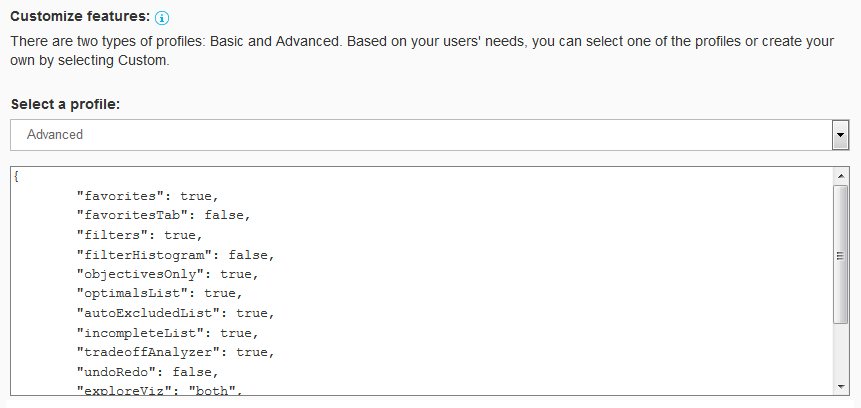
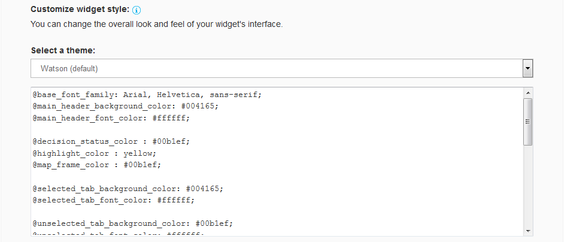

---

copyright:
  years: 2015, 2017
lastupdated: "2017-08-09"

---

{:shortdesc: .shortdesc}
{:new_window: target="_blank"}
{:tip: .tip}
{:pre: .pre}
{:codeblock: .codeblock}
{:screen: .screen}
{:javascript: .ph data-hd-programlang='javascript'}
{:java: .ph data-hd-programlang='java'}
{:python: .ph data-hd-programlang='python'}
{:swift: .ph data-hd-programlang='swift'}

# Programming with the v1 widget
{: #widget}

The {{site.data.keyword.tradeoffanalyticsshort}} widget is a JavaScript library that provides a powerful web client that lets you explore the objectives and options for a decision problem and experiment with different tradeoffs among them. The widget accepts a JSON `Problem` object, calls the service's `dilemmas` method to obtain a JSON `Dilemma` object, and presents the interactive {{site.data.keyword.tradeoffanalyticsshort}} interface. The library is available as a file named [TradeoffAnalytics.js ](http://ta-cdn.mybluemix.net/v1/TradeoffAnalytics.js){: new_window} from the {{site.data.keyword.tradeoffanalyticsshort}} Content Distribution Network (CDN).
{: shortdesc}

The `Dilemma` object returned by the {{site.data.keyword.tradeoffanalyticsshort}} service always includes the original `Problem` object and a `Resolution` object that contains the results of the analysis. By default, the `Resolution` contains both an array of `Solution` objects that describe the solution for each option and a `Map` object that provides the parameters needed by the widget to display the decision problem. If you prefer not to use the widget, you can pass a value of `false` for the `generate_visualization` query parameter of the `dilemmas` method to indicate that the service is to return only the `Solution` objects.

The following sections describe how to integrate the widget in an application and how to customize its features and appearance. For information about using the widget's interface, see [Using the widget (version 1)](/docs/services/tradeoff-analytics/visualization-v1.html).

## Integrating the widget in an application
{: #integrating}

To integrate the {{site.data.keyword.tradeoffanalyticsshort}} widget in an application, you follow a sequence of steps to create, use, and destroy an instance of the widget. The following steps describe the application lifecycle for using the widget.

In an application that includes the widget, code from the client library calls the server-side proxy service of the application. The proxy service in turn calls the {{site.data.keyword.tradeoffanalyticsshort}} service on behalf of the client.

The widget calls the {{site.data.keyword.tradeoffanalyticsshort}} service to display the initial analysis of a decision problem. It also calls the service if the user modifies the list of active objectives for the problem as described in [Working with objectives](/docs/services/tradeoff-analytics/visualization-v1.html#objectives). In both cases, the application is charged for the call to the service.

1.  *Import the client library in your application.* The following line of code includes the library in an HTML file from its public URL:

    ```javascript
    <script type="text/javascript" src="http://ta-cdn.mybluemix.net/v1/TradeoffAnalytics.js"></script>
    ```
    {: codeblock}

1.  *Create an instance of the widget.* The first step is always to create an instance of the widget. The following line of code calls the constructor for the `TA.TradeoffAnalytics` object to create a local instance named `taClient`. The widget makes no changes to the hosting document until it is started in a later step. You make all subsequent calls to the library by referring to the local instance.

    ```javascript
    var taClient = new TA.TradeoffAnalytics(options /* Object */, node /* String or DOM node */);
    ```
    {: codeblock}

    The constructor takes two arguments: The required `options` argument specifies the parameters with which the instance is to be created, and the optional `node` argument identifies a DOM node from the hosting document in which to place the widget. For more information about the constructor, see [The TA.TradeoffAnalytics constructor](#constructor).

1.  *Subscribe to event notifications.* Notifications allow the hosting application to listen for changes to the client state and respond appropriately. The following line of code subscribes to a specified topic with the indicated callback function. For more information, see [Using event notifications and callbacks](#notifications).

    ```javascript
    var s = taClient.subscribe(topic /* String */, callback /* Function */);
    ```
    {: codeblock}

1.  *Start the instance of the widget.* You start the instance of the widget to effect asynchronous loading of the {{site.data.keyword.tradeoffanalyticsshort}} resource and allocation of DOM nodes. The following line of code starts the instance of the widget created previously. The widget invokes the optional callback function when it finishes starting and is ready to receive a problem.

    ```javascript
    taClient.start(callback /* Function */);
    ```
    {: codeblock}

1.  *Show the problem resolution.* The widget calls the {{site.data.keyword.tradeoffanalyticsshort}} service via the application's server-side proxy to obtain a resolution for the decision problem and displays the results. The following line of code calls the `show` method on the local instance of the widget. The mandatory `problem` specifies the input data set in the form of a JSON object. The widget invokes the optional callback function when it is displayed in the browser.

    ```javascript
    taClient.show(problem /* Object */, callback /* Function */);
    ```
    {: codeblock}

    You can call the `show` method multiple times with different data sets.

1.  *Resize the widget.* You can resize the instance of the widget to a specified dimension in the hosting document. The following line of code calls the `resize` method on the instance of the widget. The optional width and height arguments specify the new size in pixels. By default, the widget resizes itself to fill the containing node.

    ```javascript
    taClient.resize(width /* Number */, height /* Number */);
    ```
    {: codeblock}

    As with the `show` method, you can call the `resize` method multiple times.

1.  *Remove subscriptions to event notifications.* When you no longer need them, you can remove subscriptions to event notifications for one or all topics by calling the `unsubscribe` method on the instance of a subscription or by calling the `clearSubscriptions` or `clearAllSubscriptions` methods on the instance of the widget. For more information, see [Using event notifications and callbacks](#notifications).
1.  *Destroy the instance of the widget.* When you are done using it, you discard the instance of the widget and free all of its resources by calling the `destroy` method. You can no longer use the widget once you destroy it. The following line of code destroys the instance of the widget that was created previously. The widget invokes the optional callback function when it completes the operation.

    ```javascript
    taClient.destroy(callback /* Function */);
    ```
    {: codeblock}

### The TA.TradeoffAnalytics constructor
{: #constructor}

You call the `TA.TradeoffAnalytics` constructor to create an instance of the object for use in your application. You then make all subsequent calls to the client library via the instance of the widget. The constructor has the following interface:

```javascript
TA.TradeoffAnalytics(options /* Object */, node /* String or DOM node */)
```
{: codeblock}

The required `options` argument is a JSON object that specifies the parameters with which the instance is to be created. The following table describes the fields of this JSON object.

<table>
  <caption>Table 1. Fields of the <code>options</code> argument</caption>
  <tr>
    <th style="text-align:left">Field</th>
    <th style="text-align:center">Type</th>
    <th style="text-align:center">Ordinality</th>
    <th style="text-align:left">Description</th>
  </tr>
  <tr>
    <td>
      <code>dilemmaServiceUrl</code>
    </td>
    <td style="text-align:center">
      String
    </td>
    <td style="text-align:center">
      Mandatory
    </td>
    <td>
      The URL for the Tradeoff Analytics service. This argument
      typically refers to a proxy to which the widget delegates calls
      to the actual service. The widget interacts with the service to
      find the optimal options and to obtain the layout of its interface.
    </td>
  </tr>
  <tr>
    <td>
      <code>username</code>
    </td>
    <td style="text-align:center">
      String
    </td>
    <td style="text-align:center">
      Optional
    </td>
    <td>
      The user name that is needed to access the Tradeoff Analytics
      service or the proxy. You use HTTP basic authentication credentials
      to authenticate to the service.
    </td>
  </tr>
  <tr>
    <td>
      <code>password</code>
    </td>
    <td style="text-align:center">
      String
    </td>
    <td style="text-align:center">
      Optional
    </td>
    <td>
      The password that is needed to access the Tradeoff Analytics
      service or the proxy. You use HTTP basic authentication credentials
      to authenticate to the service.
    </td>
  </tr>
  <tr>
    <td>
      <code>customCssUrl</code>
    </td>
    <td style="text-align:center">
      String
    </td>
    <td style="text-align:center">
      Optional
    </td>
    <td>
      An absolute URL to a custom CSS theme for the widget. You can
      use one of the three predefined stylesheets or create an
      application-specific theme and make it available from the
      web. By default, the widget uses the Watson theme. For more
      information, see <a href="#usingThemes">Customizing the widget's
        appearance</a>.
    </td>
  </tr>
  <tr>
    <td>
      <code>profile</code>
    </td>
    <td style="text-align:center">
      String or Object
    </td>
    <td style="text-align:center">
      Optional
    </td>
    <td>
      Specifies a set of activated features for the widget. You can
      use one of the predefined profiles or create a custom profile
      and pass it to the constructor. By default, the widget uses the
      Basic profile. For more information, see
      <a href="#usingProfiles">Customizing the widget's features</a>.
    </td>
  </tr>
  <tr>
    <td>
      <code>locale</code>
    </td>
    <td style="text-align:center">
      String
    </td>
    <td style="text-align:center">
      Optional
    </td>
    <td>
      Specifies a language to use with the widget's interface. By default,
      the widget uses the locale specified by the browser in which the
      hosting application is running. If the widget does not support the
      browser's locale, it defaults to using English. Use this argument
      only if you need to enforce a specific locale.<br/><br/>
      The widget supports the following languages: Brazilian Portuguese
      (<em>pt-br</em>), Chinese (<em>zh</em>), Chinese (Taiwan)
      (<em>zh-tw</em>), English (<em>en</em>), French (<em>fr</em>),
      German (<em>de</em>), Italian (<em>it</em>), Japanese (<em>ja</em>),
      Korean (<em>ko</em>), and Spanish (<em>es</em>).
    </td>
  </tr>
  <tr>
    <td>
      <code>errCallback</code>
    </td>
    <td style="text-align:center">
      Function
    </td>
    <td style="text-align:center">
      Optional
    </td>
    <td>
      Specifies a callback function to be invoked in the event of
      an error within the widget. For more information, see
      <a href="#notifications">Using event notifications and callbacks</a>.
      The function specified with this field must accept the
      <code>errorMessage</code> object defined for the
      <code>afterError</code> topic described in
      <a href="#topics">Available notification topics</a>.
    </td>
  </tr>
</table>

The optional `node` argument specifies a Document Object Model (DOM) node from the hosting document in which to place the widget. You can specify a node ID (string) or a DOM object. If you omit this argument, the widget is created under the document body. The widget is always isolated in a separate iframe in the containing document.

## Using event notifications and callbacks
{: #notifications}

The {{site.data.keyword.tradeoffanalyticsshort}} widget provides a mechanism that allows the hosting application to subscribe to notifications from the client library. Notifications enable the application to listen for and respond to changes to the client state. The application registers a callback function to be invoked when an event takes place. For more information, see [Subscribing to notification topics](#subscribing) and [Available notification topics](#topics).

Some functions of the widget's interface also support optional callback arguments. The application can use these arguments to pass functions that the widget invokes when specific events occur. For more information, see [Argument-based callback functions](#callbacks).

Both the subscription- and argument-based approaches let the hosting application respond to asynchronous events. But event notifications offer a more fine-grained approach that supports a broader set of events. For code examples that compare the different models, see [Examples of the two approaches](#callbackExamples).

### Subscribing to notification topics
{: #subscribing}

To use event notifications, an application first subscribes to a *topic*. When it subscribes to a topic, the application provides a JavaScript callback function that accepts a payload object that carries information about the occurrence of events associated with that topic. When a change that is associated with the topic occurs, the widget invokes the callback function and passes it an event object with information about the event that fired. For more information about the topics, see [Available notification topics](#topics).

To subscribe to a new topic, you call the `subscribe` method of an instance of the `TA.TradeoffAnalytics` client object. You supply the name of the topic and a callback function. The method returns an instance of the subscription to the specified topic.

When you no longer need the subscription to a topic, you can unsubscribe from the topic by calling the `unsubscribe` method of the subscription instance. In addition, the `TA.TradeoffAnalytics` client object also provides two convenient methods for clearing subscriptions:

-   The `clearSubscriptions` method takes the name of a topic as its sole argument and removes all subscriptions for the specified topic.
-   The `clearAllSubscriptions` method takes no argument and clears all subscriptions for all topics.

The following example code shows the methods that you can use to subscribe to and to unsubscribe from topics. In the examples, `taClient` is an instance of the `TA.TradeoffAnalytics` widget.

```javascript
function errorHandler(payload){
  // Do something to handle an error. For example, write the error to the console.
  console.error(payload.errorMessage);
}

// Subscribe to the afterError topic with the callback function named errorHandler.
var topic = taClient.subscribe('afterError', errorHandler);

// Unsubscribe from the afterError topic.
topic.unsubscribe();

// Remove all subscriptions for the afterError topic.
taClient.clearSubscriptions('afterError');

// Clear all subscriptions for all topics.
taClient.clearAllSubscriptions();

```
{: codeblock}

### Available notification topics
{: #topics}

The {{site.data.keyword.tradeoffanalyticsshort}} widget provides a number of notification topics. When an event associated with a topic fires, the widget returns an event object for that topic. The event objects for all topics carry a `type` field, which is a string with the name of the topic. Some event objects have additional fields that provide more information about the event that fired.

Notification topics fall into two categories: Static topics whose payloads are guaranteed not to change, and experimental topics whose payloads are subject to change in future versions of the service. The following table lists and describes the static topics, including their payloads. (The table does not list the `type` field that is common to all event objects.)

<table>
  <caption>Table 2. Static topics</caption>
  <tr>
    <th style="text-align:left; width:35%">Topic / Fires when...</th>
    <th style="text-align:left; width:35%">Payload</th>
    <th style="text-align:left">Fields</th>
  </tr>
  <tr>
    <td style="vertical-align:top"><code>started</code><br/>
    The client starts.</td>
    <td style="vertical-align:top">None</td>
    <td style="vertical-align:top">None</td>
  </tr>
  <tr>
    <td style="vertical-align:top"><code>destroyed</code><br/>
    The client is destroyed.</td>
    <td style="vertical-align:top">None</td>
    <td style="vertical-align:top">None</td>
  </tr>
  <tr>
    <td style="vertical-align:top"><code>afterError</code><br/>
    An error occurs due either to invalid input or a programming error.</td>
    <td style="vertical-align:top"><pre><code>{
  errorMessage: string
}</code></pre></td>
    <td style="vertical-align:top"><code>errorMessage</code>: A message that describes the error.</td>
  </tr>
  <tr>
    <td style="vertical-align:top"><code>problemChanged</code><br/>
    A new or modified decision problem is displayed.</td>
    <td style="vertical-align:top"><pre><code>{
  problemAfter: {
      problem: Problem,
      resolution: Resolution
  },
  problemBefore: {
      problem: Problem,
      resolution: Resolution
  }
}</code></pre></td>
    <td style="vertical-align:top"><code>problemAfter</code>: The new problem and its
  resolution.<br/><br/>
  <code>problemBefore</code>: The previous problem and its resolution;
  empty on the first call to the widget.</td>
  </tr>
  <tr>
    <td style="vertical-align:top"><code>doneClicked</code><br/>
    The user clicks the <strong>Done</strong> button.</td>
    <td style="vertical-align:top"><pre><code>{
  selectedOptionKeys: [string]
}</code></pre></td>
    <td style="vertical-align:top"><code>selectedOptionKeys</code>: A list of option keys
  selected as final decisions. The service currently supports selection
  of only a single option.</td>
  </tr>
  <tr>
    <td style="vertical-align:top"><code>optionClicked</code><br/>
    The user clicks an option.</td>
    <td style="vertical-align:top"><pre><code>{
  optionKey: string,
  view: string,
  x: number,
  y: number
}</code></pre></td>
    <td style="vertical-align:top"><code>optionKey</code>: The option key that was
  clicked.<br/><br/>
  <code>view</code>: The name of the view in which the user
  clicked.<br/><br/>
  <code>x</code>: The X position of the click in page pixels.<br/><br/>
  <code>y</code>: The Y position of the click in page pixels.</td>
  </tr>
</table>

The following table lists and describes the experimental topics, all of which begin with `X_`. The topics' payloads might change in future versions of the service. (The `type` field that is common to all event objects is again omitted.)

<table>
  <caption>Table 3. Experimental topics</caption>
  <tr>
    <th style="text-align:left; width:35%">Topic / Fires when...</th>
    <th style="text-align:left; width:35%">Payload</th>
    <th style="text-align:left">Fields</th>
  </tr>
  <tr>
    <td style="vertical-align:top"><code>X_finalDecisionChanged</code><br/>
    The user changes the final decision.</td>
    <td style="vertical-align:top"><pre><code>{
  finalOptionKeysAfter: [string],
  finalOptionKeysBefore: [string]
}</code></pre></td>
    <td style="vertical-align:top"><code>finalOptionKeysAfter</code>: A list of option
      keys included in the final decision after the change.<br/><br/>
      <code>finalOptionKeysBefore</code>: A list of option keys included
      in the final decision before the change.<br/><br/> The widget
      currently supports selection of only one final decision.
    </td>
  </tr>
  <tr>
    <td style="vertical-align:top"><code>X_favoritesChanged</code><br/>
    The user changes the set of favorite options.</td>
    <td style="vertical-align:top"><pre><code>{
  addedOptionKeys: [string],
  removedOptionKeys: [string],
  allOptionKeys: [string]
}</code></pre></td>
    <td style="vertical-align:top"><code>addedOptionKeys</code>: A list of option keys
      added to the set of favorites.<br/><br/>
      <code>removedOptionKeys</code>: A list of option keys removed
      from the set of favorites.<br/><br/>
      <code>allOptionKeys</code>: A list of all option keys currently
      listed among the favorites.</td>
  </tr>
  <tr>
    <td style="vertical-align:top"><code>X_selectionChanged</code><br/>
    The user changes the set of selected options.</td>
    <td style="vertical-align:top"><pre><code>{
  addedOptionKeys: [string],
  removedOptionKeys: [string],
  allOptionKeys: [string]
}</code></pre></td>
    <td style="vertical-align:top"><code>addedOptionKeys</code>: A list of option keys
      added to the current selection.<br/><br/>
      <code>removedOptionKeys</code>: A list of option keys removed
      from the current selection.<br/><br/>
      <code>allOptionKeys</code>: A list of all option keys currently
      selected.</td>
  </tr>
  <tr>
    <td style="vertical-align:top"><code>X_filterChanged</code><br/>
    The user changes a column filter.</td>
    <td style="vertical-align:top"><pre><code>{
  columnKey: string,
  action: 'reset' | 'changed',
  valueAfter: {
    low: number,
    high: number | [string]
  },
  valueBefore: {
    low: number,
    high: number | [string]
  },
  filteredInOptionKeys: [string],
  filteredOutOptionKeys: [string],
  allIncludedOptionKeys: [string]
}</code></pre></td>
    <td style="vertical-align:top"><code>columnKey</code>: The key of the column whose
      filter has changed.<br/><br/>
      <code>action</code>: An indication of whether the filter was reset
      or modified in some other way.<br/><br/>
      <code>valueAfter</code>: For numeric columns, the low and high
      values of the new column filter; for categorical columns, a list
      of the categories that are valid after the column filter
      changed.<br/><br/>
      <code>valueBefore</code>: For numeric columns, the low and high
      values of the previous column filter; for categorical columns, a
      list of the categories that were valid before the column filter
      changed.<br/><br/>
      <code>filteredInOptionKeys</code>: A list of option keys included
      as a result of the filter change.<br/><br/>
      <code>filteredOutOptionKeys</code>: A list of option keys excluded
      as a result of the filter change.<br/><br/>
      <code>allIncludedOptionKeys</code>: A list of all option keys that
      meet the requirements of the changed filter.</td>
  </tr>
  <tr>
    <td style="vertical-align:top"><code>X_optionHovered</code><br/>
    The user hovers the mouse over an option.</td>
    <td style="vertical-align:top"><pre><code>{
  optionKey: string,
  isIn: boolean
}</code></pre></td>
    <td style="vertical-align:top"><code>optionKey</code>: The option key over which the
      user is hovering.<br/><br/>
      <code>isIn</code>: True when the user is hovering over the option,
      false when the user is no longer hovering over the option.</td>
  </tr>
</table>

### Argument-based callback functions
{: #callbacks}

A number of the functions from the client library also support event notification in the form of callback functions that you specify when you invoke the functions. Such callback functions, like subscriptions, are always optional. However, although the specified callback functions provide equivalent functionality to subscriptions, they are not persistent and apply only to the call for which they are specified.

The following functions of the widget's interface support optional callback functions. For more information about using the individual functions, see [Integrating the widget in an application](#integrating).

-   The `options` argument of the `TA.TradeoffAnalytics` constructor accepts an optional `errCallback` field:

    ```javascript
    TA.TradeoffAnalytics(options /* Object */, node /* String or DOM node */)
    ```
    {: codeblock}

    The callback fires when the client encounters an error due to invalid input or a programming error. The widget returns information about the error in the form of the payload described for the `afterError` topic, which the callback function must accept as its lone argument. For more information, see [Available notification topics](#topics).
-   The `start` function accepts an optional `callback` argument:

    ```javascript
    start(callback /* Function */)
    ```
    {: codeblock}

    The callback fires when the client is started. The widget returns no additional information for this event.
-   The `destroy` function accepts an optional `callback` argument:

    ```javascript
    destroy(callback /* Function */);
    ```
    {: codeblock}

    The callback fires when the client is destroyed. The widget returns no additional information for this event.
-   The `show` function accepts an optional `callback` argument:

    ```javascript
    show(problem /* Object */, callback /* Function */);
    ```
    {: codeblock}

    The callback fires when the widget displays a decision problem in the browser. The widget returns the payload described for the `problemChanged` topic, which the callback function must accept as its sole argument. For more information, see [Available notification topics](#topics).

### Examples of the two approaches
{: #callbackExamples}

The following examples compare the use of argument-based callback functions with the subscription-based approach to event notifications. The examples show generally equivalent functionality achieved with each of the two approaches.

#### Argument-based callback example

The following example shows the use of argument-based callbacks. The first snippet of code defines a general callback function named `onError`. If it is passed an `error` string, the function displays that string; otherwise, it displays the generic message defined by the variable `errorMsg`. The snippet also defines the `onPageReady` function, which is meant to be invoked when the widget starts and is ready to receive a problem.

```javascript
function onError(error) {
  var errorMsg = 'Error processing the request.';
  $('.errorMsg').text(error ? JSON.stringify(error, null, 4) : errorMsg);
  $('.errorArea').show();
  onPageReady();
}

function onPageReady() {
  $('.analyze').show();
  $('.loading').hide();
}
```
{: codeblock}

The following snippet shows a call to the `loadTradeoffAnalytics` function. The call passes references to the `onPageReady` and `onError` functions as its final two arguments.

```javascript
loadTradeoffAnalytics('basic', 'watson', onPageReady, onError);
```
{: codeblock}

The `loadTradeoffAnalytics` function refers to the two parameters as `callback` and `errCallback`, respectively. The function accepts the callbacks as parameters because it can use different callbacks in different cases.

```javascript
function loadTradeoffAnalytics(profile, themeName, callback, errCallback) {
  taClient = new TA.TradeoffAnalytics({
    dilemmaServiceUrl: '/',
    customCssUrl: 'http://ta-cdn.mybluemix.net/v1.modmt/styles/' + themeName + '.css',
    profile: profile,
    errCallback: errCallback
  }, 'taWidgetContainer');

  taClient.start(callback);
}
```
{: codeblock}

The function first calls the `TA.TradeoffAnalytics` constructor. It passes the `onError` function to the constructor via the `errCallback` field of the JSON object it passes as the constructor's `options` argument. This callback fires in the event of an error.

The function then calls the `start` function of the new `taClient` instance. It passes the function the `onPageReady` callback as its sole argument. This callback fires when the widget is loaded.

#### Event notification example

The following example illustrates the use of subscriptions and event notifications. The code snippet shows a call to the `loadTradeoffAnalytics` function and the definition of the function. The example omits the definitions of the callback functions, which are similar to the definitions in the previous section.

This version of `loadTradeoffAnalytics` is functionally equivalent to the version shown in the previous section. The two versions of the function have the same signature, so this version also accepts `callback` and `errCallback` arguments.

```javascript
loadTradeoffAnalytics('basic', 'watson', onPageReady, onError);
```
{: codeblock}

After creating the `taClient` instance, the function uses the the `subscribe` function of the new instance to set callbacks for the `started`, `afterError`, and `doneClicked` events. (The `onResultSelection` callback is always registered for the `doneClicked` event, regardless of how the function is invoked, so it does not need to be passed to the function.)

```javascript
function loadTradeoffAnalytics(profile, themeName, callback, errCallback) {
  taClient = new TA.TradeoffAnalytics({
    dilemmaServiceUrl: '/',
    customCssUrl: 'http://ta-cdn.mybluemix.net/v1/modmt/styles/' + themeName + '.css',
    profile: profile
  }, 'taWidgetContainer');

  taClient.subscribe('started', callback);
  taClient.subscribe('afterError', errCallback);
  taClient.subscribe('doneClicked', onResultSelection);

  var topics = [ 'started', 'problemChanged', 'destroyed', 'doneClicked', 'optionClicked', 'X_finalDecisionChanged',
    'X_favoritesChanged', 'X_selectionChanged', 'X_filterChanged'/*, 'X_optionHovered'*/ ];
  topics.forEach(function(t){
    taClient.subscribe(t, function (e){
      console.log(JSON.stringify(e));
    });
  });

  taClient.start();
}
```
{: codeblock}

Because it subscribes to the `afterError` event, the function does not need to include the `errCallback` field of the JSON object it passes to the constructor. Similarly, because it subscribes to the `started` event, it does not need to pass a callback argument to the `start` function. The function also subscribes to the additional events specified by the `topics` variable so that it can log appropriate messages when they occur. This additional functionality is not available with argument-based callbacks.

## Customizing the widget's features
{: #usingProfiles}

You use *profiles* to control the activated features available with the {{site.data.keyword.tradeoffanalyticsshort}} widget. The widget provides many features for supporting various use cases. Some of the features are complex and meant for more advanced users. The widget comes with two built-in profiles that reflect this usage model:

-   The *Basic* profile is designed for applications whose users are occasional or inexperienced. This profile avoids features that require deeper familiarity with the interface.
-   The *Advanced* profile is intended for applications whose users are more sophisticated knowledge workers. Such users have the time to learn and understand the additional features and to apply them to decisions that are important or strategic.

The following image shows selection of the Basic (default) profile.



The following table lists the features available for customization. It briefly describes each feature, the type of value it accepts, and its settings for the Basic and Advanced profiles.

<table>
  <caption>Table 4. Customization features</caption>
  <tr>
    <th style="text-align:left">Entry name</th>
    <th style="text-align:center">Type</th>
    <th style="text-align:left">Description</th>
    <th style="text-align:center">Basic</th>
    <th style="text-align:center">Advanced</th>
  </tr>
  <tr>
    <td><code>optionHighlighting</code></td>
    <td style="text-align:center">Boolean</td>
    <td>Indicates whether the user can mark certain options
      by a specific color.</td>
    <td style="text-align:center"><code>true</code></td>
    <td style="text-align:center"><code>true</code></td>
  </tr>
  <tr>
    <td><code>favorites</code></td>
    <td style="text-align:center">Boolean</td>
    <td>Indicates whether the user can mark certain options
      as favorite (starred) options.</td>
    <td style="text-align:center"><code>true</code></td>
    <td style="text-align:center"><code>true</code></td>
  </tr>
  <tr>
    <td><code>favoritesTab</code></td>
    <td style="text-align:center">Boolean</td>
    <td>Indicates whether the user sees both the Explore and
      Favorites tabs; when <code>false</code>, the Explore tab is maximized.
      This feature is applicable only when <code>favorites</code> is
      <code>true</code>.</td>
    <td style="text-align:center"><code>false</code></td>
    <td style="text-align:center"><code>true</code></td>
  </tr>
  <tr>
    <td><code>optionDetails</code></td>
    <td style="text-align:center">Boolean</td>
    <td>Indicates whether to show an informational pop-up box
      when the user clicks on an option.</td>
    <td style="text-align:center"><code>true</code></td>
    <td style="text-align:center"><code>true</code></td>
  </tr>
  <tr>
    <td><code>filters</code></td>
    <td style="text-align:center">Boolean</td>
    <td>Indicates whether to display the filters panel,
      which is located on the left side of the widget.</td>
    <td style="text-align:center"><code>true</code></td>
    <td style="text-align:center"><code>true</code></td>
  </tr>
  <tr>
    <td><code>filterHistogram</code></td>
    <td style="text-align:center">Boolean</td>
    <td>Indicates whether to show an animated histogram when
      moving a filter slider. This feature is applicable only when
      <code>filters</code> is <code>true</code>.</td>
    <td style="text-align:center"><code>false</code></td>
    <td style="text-align:center"><code>true</code></td>
  </tr>
  <tr>
    <td><code>objectivesOnly</code></td>
    <td style="text-align:center">Boolean</td>
    <td>Indicates whether to show only attributes that are
      objectives; when <code>false</code>, all columns are shown.</td>
    <td style="text-align:center"><code>true</code></td>
    <td style="text-align:center"><code>false</code></td>
  </tr>
  <tr>
    <td><code>optimalsList</code></td>
    <td style="text-align:center">Boolean</td>
    <td>Indicates whether to show the list of optimal options,
      which is located on the right side of the widget.</td>
    <td style="text-align:center"><code>true</code></td>
    <td style="text-align:center"><code>true</code></td>
  </tr>
  <tr>
    <td><code>autoExcludedList</code></td>
    <td style="text-align:center">Boolean</td>
    <td>Indicates whether to show the list of dominated
      (auto-excluded) options, which is located on the right side of
      the widget.</td>
    <td style="text-align:center"><code>true</code></td>
    <td style="text-align:center"><code>true</code></td>
  </tr>
  <tr>
    <td><code>incompleteList</code></td>
    <td style="text-align:center">Boolean</td>
    <td>Indicates whether to show the list of incomplete
      options, which is located on the right side of the widget.</td>
    <td style="text-align:center"><code>true</code></td>
    <td style="text-align:center"><code>true</code></td>
  </tr>
  <tr>
    <td><code>tradeoffAnalyzer</code></td>
    <td style="text-align:center">Boolean</td>
    <td>Indicates whether to notify the user of a better
      tradeoff than a selected option.</td>
    <td style="text-align:center"><code>true</code></td>
    <td style="text-align:center"><code>true</code></td>
  </tr>
  <tr>
    <td><code>undoRedo</code></td>
    <td style="text-align:center">Boolean</td>
    <td>Indicates whether to allow to user to undo and redo
      recent actions.</td>
    <td style="text-align:center"><code>false</code></td>
    <td style="text-align:center"><code>true</code></td>
  </tr>
  <tr>
    <td><code>exploreViz</code></td>
    <td style="text-align:center">Enumeration</td>
    <td>Specifies what visualizations to enable:
      <ul style="margin-left:20px; padding:0px;">
        <li style="margin:10px 0px; color:#404040; line-height:120%;">
          <code>lines</code> enables only the parallel-coordinates
          visualization
        </li>
        <li style="margin:10px 0px; color:#404040; line-height:120%;">
          <code>map</code> enables only the visualization map
        </li>
        <li style="margin:10px 0px; color:#404040; line-height:120%;">
          <code>both</code> makes both forms of visualization available
          to the user
        </li>
      </ul>
    </td>
    <td style="text-align:center"><code>both</code></td>
    <td style="text-align:center"><code>both</code></td>
  </tr>
  <tr>
    <td><code>questionEditor</code></td>
    <td style="text-align:center">Enumeration</td>
    <td>Specifies the level of interaction enabled with
      the description of the decision problem in the banner of the
      widget:
      <ul style="margin-left:20px; padding:0px;">
        <li style="margin:10px 0px; color:#404040; line-height:120%;">
          <code>false</code> displays no interactive descriptions
        </li>
        <li style="margin:10px 0px; color:#404040; line-height:120%;">
          <code>readOnly</code> displays the question but supports no user
          interaction
        </li>
        <li style="margin:10px 0px; color:#404040; line-height:120%;">
          <code>editableNoToggle</code> allows the user to add and remove
          objectives, but the user cannot change the objective goals
          (minimization and maximization)
        </li>
        <li style="margin:10px 0px; color:#404040; line-height:120%;">
          <code>fullyEditable</code> allows the user to modify the
          objectives and their goals
        </li>
      </ul>
    </td>
    <td style="text-align:center">
      <code>editableNoToggle</code></td>
    <td style="text-align:center">
      <code>fullyEditable</code></td>
  </tr>
</table>

You specify the profile by using the `profile` parameter of the `TA.TradeoffAnalytics` constructor function. The argument to the parameter can be one of `basic`, `advanced`, or a JavaScript object that specifies application-specific differences from one of the built-in profiles.

For example, the following snippet of code shows the `LoadTradeoffAnalytics` function. The function passes the constructor the profile that it receives as its first argument.

```javascript
function loadTradeoffAnalytics(profile, themeName, callback, errCallback) {
   taClient = new TA.TradeoffAnalytics({
      dilemmaServiceUrl: '/',
      customCssUrl: 'http://ta-cdn.mybluemix.net/v1/modmt/styles/' + themeName + '.css',
      profile: profile
   }, 'taWidgetContainer');
   . . .
   taClient.start();
}
```
{: codeblock}

The following example is similar to the first, but this code disables the `filters` feature. The remainder of the features, those left unspecified, are based directly on the profile that is passed to the function.

```javascript
function loadTradeoffAnalytics(profile, themeName, callback, errCallback) {
   taClient = new TA.TradeoffAnalytics({
      dilemmaServiceUrl: '/',
      customCssUrl: 'http://ta-cdn.mybluemix.net/v1/modmt/styles/' + themeName + '.css',
      profile: {
         filters: false
      },
   }, 'taWidgetContainer');
   . . .
   taClient.start();
}
```
{: codeblock}

If no argument is passed or if an invalid profile is provided, the widget applies the Basic profile by default.

## Customizing the widget's appearance
{: #usingThemes}

You use *themes* to control the look and feel of the widget. You specify the theme, or style, for the widget as CSS. Three predefined themes are available for the widget from the {{site.data.keyword.tradeoffanalyticsshort}} CDN:

-   The *{{site.data.keyword.watson}}* theme ([watson.css ](http://ta-cdn.mybluemix.net/v1/modmt/styles/watson.css){: new_window})
-   The *Teal* theme ([teal.css ](http://ta-cdn.mybluemix.net/v1/modmt/styles/teal.css){: new_window})
-   The *Dark* theme ([dark.css ](http://ta-cdn.mybluemix.net/v1/modmt/styles/dark.css){: new_window})

The following image shows selection of the {{site.data.keyword.watson}} (default) theme.



You can generate a custom CSS theme file to override the variable values and pass the file to the {{site.data.keyword.tradeoffanalyticsshort}} widget. You generate a custom CSS theme by using LESS technology ([lesscss.org ](http://lesscss.org/){: new_window}), which supports the use of variables to specify the style. The {{site.data.keyword.tradeoffanalyticsshort}} styles use a predefined set of variables and default values. The file <a href="https://watson-developer-cloud.github.io/doc-tutorial-downloads/tradeoff-analytics/CSS-Theme-Specification.pdf" download="CSS-Theme-Specification.pdf">CSS-Theme-Specification.pdf </a> describes the variables and values for the {{site.data.keyword.watson}} theme. Note that customization of the visualization is not currently supported; for example, you cannot customize the glyph colors and fonts used in the visualization map.

To generate a custom CSS theme for your application, you must have Node.js and `npm` installed on your local machine. Once you do, perform the following steps:

1.  Make sure you have LESS installed. To check whether you have it installed, run the following at a system or command prompt:

    ```
    lessc --version
    ```
    {: screen}

    If the command does not display a software version such as `lessc 2.1.0 (Less Compiler) [JavaScript]`, you probably need to use the `npm` command to install the LESS technology.
1.  Download the file that contains the LESS source files for the {{site.data.keyword.tradeoffanalyticsshort}} service to your local machine. You can download one of three compressed versions of the files, depending on your operating system and personal preference: <a href="https://watson-developer-cloud.github.io/doc-tutorial-downloads/tradeoff-analytics/tradeoff-analytics-less.zip" download="tradeoff-analytics-less.zip">tradeoff-analytics-less.zip </a>, <a href="https://watson-developer-cloud.github.io/doc-tutorial-downloads/tradeoff-analytics/tradeoff-analytics-less.tar.gz" download="tradeoff-analytics-less.tar.gz">tradeoff-analytics-less.tar.gz </a>, or <a href="https://watson-developer-cloud.github.io/doc-tutorial-downloads/tradeoff-analytics/tradeoff-analytics-less.tar.bz2" download="tradeoff-analytics-less.tar.bz2">tradeoff-analytics-less.tar.bz2 </a>. After you download the file, extract its contents and change directories to `tradeoff-analytics-less`.
1.  Make a copy of the file `custom.less` and rename the copy to something unique like `myStyle.less`.
1.  Open your copy of the file in a text editor, and uncomment and override any variable values you wish to change. Any variable that you do not override retains its default value.
1.  Enter the following command in the directory that contains your modified `.less` file (for example, `myStyle.less`) to generate a new CSS theme:

    ```
    lessc myStyle.less myStyle.css
    ```
    {: screen}

1.  Make sure the generated CSS file is accessible from the web, and pass the URL for the file to the `TA.TradeoffAnalytics` constructor by using the `customCssUrl` parameter.

You pass a file that defines the theme for your application to the {{site.data.keyword.tradeoffanalyticsshort}} widget via the `customCssUrl` parameter of the `TA.TradeoffAnalytics` constructor. The following snippet of code shows the `LoadTradeoffAnalytics` function. The function passes the constructor the theme whose name it receives as its second argument. The application accesses the theme from the {{site.data.keyword.tradeoffanalyticsshort}} CDN.

```javascript
function loadTradeoffAnalytics(profile, themeName, callback, errCallback) {
   taClient = new TA.TradeoffAnalytics({
      dilemmaServiceUrl: '/',
      customCssUrl: 'http://ta-cdn.mybluemix.net/v1/modmt/styles/' + themeName + '.css',
      profile: profile
   }, 'taWidgetContainer');
   . . .
   taClient.start();
}
```
{: codeblock}

If no argument is passed or if an invalid theme is indicated, the widget applies the {{site.data.keyword.watson}} theme by default.
