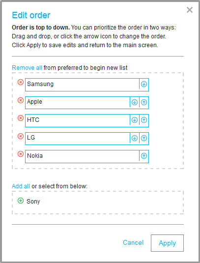

---

copyright:
  years: 2015, 2017
lastupdated: "2017-08-09"

---

{:shortdesc: .shortdesc}
{:new_window: target="_blank"}
{:tip: .tip}
{:pre: .pre}
{:codeblock: .codeblock}
{:screen: .screen}
{:javascript: .ph data-hd-programlang='javascript'}
{:java: .ph data-hd-programlang='java'}
{:python: .ph data-hd-programlang='python'}
{:swift: .ph data-hd-programlang='swift'}

# Using the v1 widget
{: #visualization}

The {{site.data.keyword.tradeoffanalyticsshort}} client library, or *widget*, is the recommended approach to consuming and displaying the results of a problem resolution. The library provides a powerful web client that lets you explore a decision problem's objectives and options and experiment with different tradeoffs among them. The interface provides an intuitive visual means of exploring the objectives and options. The following sections describe how to use the widget's interface.
{: shortdesc}

For information about integrating the widget with an application, see [Programming with the widget (version 1)](/docs/services/tradeoff-analytics/client-v1.html).

## Overview of the interface
{: #overview}

The {{site.data.keyword.tradeoffanalyticsshort}} widget graphically presents the objectives and options for a decision problem. The following image shows the layout and primary components of the interface.

The labeled areas provide the following functionality:

-   The *visualization* area is the heart of the interface. The widget can display one of two visualizations: a visualization map or a parallel-coordinates visualization. The two approaches provide equivalent views of the decision problem. You can always switch between the two views at any time by using the convenient icon in the upper right corner of the visualization. For more information about the two types of visualization, see
    -   [Working with the visualization map](#map)
    -   [Working with the parallel-coordinates visualization](#pc)

    Note that the widget's interface is sometimes referred to generally as the *visualization*. But technically speaking, the visualization is just one component of the interface, albeit the primary one.
-   The *objectives* area lists the active objectives for the decision problem. Active objectives are those that contribute to the problem resolution. For more information, see [Working with objectives](#objectives). (This area is also referred to as the *Question Editor* because it lets you modify the parameters of the decision problem.)
-   The *filters* area lets you refine an objective's effect on the resolution by setting ranges for its acceptable values. For more information, see [Filtering numeric and temporal objectives](#filterNumeric) and [Filtering categorical objectives](#filterCategorical).
-   The *options* area lists the options according to the categories determined by the service's analysis of the problem. For more information, see [Working with options](#options).
-   The *banner* area provides a heading for the interface and a button that lets you indicate when you have made a decision. It can also enable additional capabilities depending on the profile you elect to use. For more information, see [Choosing an option](#choosing) and [Customizing the widget](#customizing).

## Customizing the widget
{: #customizing}

You can customize two aspects of the widget's interface:

-   *Profiles* let you control the features that are available with the interface. The widget comes with two profiles:
    -   The *Basic* (default) profile is meant for occasional or inexperienced users. It hides features that require deeper familiarity with the interface.
    -   The *Advanced* profile is meant for more sophisticated users who have the time to learn, understand, and apply more complex features.

    For information about specifying and modifying profiles programmatically, see [Customizing the widget's features](/docs/services/tradeoff-analytics/client-v1.html#usingProfiles).
-   *Themes* let you modify the appearance or style of the interface. The widget provides three themes: *{{site.data.keyword.watson}}* (the default), *Teal*, and *Dark*. For information about specifying and creating styles programmatically, see [Customizing the widget's appearance](/docs/services/tradeoff-analytics/client-v1.html#usingThemes).

The following sections describe and show images of functionality available with the default Basic profile. For information about the additional features available with the Advanced profile, see [Using the Advanced profile](#advanced). All of the images in the following sections are based on the default {{site.data.keyword.watson}} theme.

## Working with the visualization map
{: #map}

The first type of visual display is the visualization map. The visualization map graphically depicts the objectives and options for the decision problem on a two-dimensional polygon.

-  Each *objective* is a vertex of the polygon that appears in the center of the visualization. The vertices that represent the objectives are color-coded, and a button of the same color is positioned at each vertex.
-   Each *top option* is represented by a polar-area glyph within the polygon. The colors shown in the glyphs indicate the extent to which each option satisfies the matching objective. The amount of color shown in each slice of the glyph is proportional to the option's value for that objective. In addition, the glyphs are positioned according to their objective values: Options whose values are better for an objective are positioned closer to the vertex for that objective. Finally, mousing over an option in the list at the right of the interface highlights its glyph.

The following image shows the visualization map populated with data from a phones data set. The visualization considers 13 options against five objectives; the objectives have been refined to exclude some of the options. The glyphs for options that have been excluded as a result of refined objectives are grayed out in the polygon.

Sometimes, when options are very similar to each other, they are clustered. You can click on the cluster to expand and show the individual options. In the previous image, the clustered glyph that is lowest in the polygon is expanded to show that it represents two options, in this case, the two **Apple iPhone 5** options.

You can disable, or turn off, an objective by clicking on the colored button at its vertex. Disabling an objective grays out both the objective and the slices in the glyphs that correspond to that objective.

## Working with the parallel-coordinates visualization
{: #pc}

The second type of visual display is a line-based view referred to as a parallel-coordinates visualization. Parallel coordinates is a common pattern for geometrically visualizing and analyzing multi-variable data in a multi-dimensional space. Like the visualization map, the parallel-coordinates view provides features to help you explore the decision problem.

-   Each *objective* is represented by a vertical line that appears in the central region of the visualization. The vertical lines are color-coded to match the color of the label and button that appear at the base of each line.
-   Each *top option* is shown as a roughly horizontal polyline in the visualization. The polylines are color-coded to make it easier to tell them apart. Mousing over an option in the list at the right of the interface highlights its polyline.

The following image shows the parallel-coordinates visualization populated with data from the phones data set. The visualization considers 13 options and five objectives. The objectives have been refined to exclude some options. The polylines for options that have been excluded as a result of refined objectives are grayed out.

Better values are always positioned vertically higher on the line for an objective. In other words, options are always ranked in a top-down fashion for each objective. If an objective is to be minimized, with lower values considered better than higher values, the objective's line is inverted so that better (in this case, lower) values are shown at the top.

The polyline for each option intersects the vertical line for an objective at a position that reflects the option's value for that objective. The intersection point indicates the extent to which the option satisfies the objective. The higher the point at which a polyline intersects a vertical line, the better that option satisfies that objective.

You can disable an objective by clicking the button at the bottom of its vertical line. Disabling an objective moves it to the right side of the display. In addition, you can change the order of the objectives by dragging the vertical line for an objective to a new position.

## Working with objectives
{: #objectives}

When it analyzes the options for a decision problem, the {{site.data.keyword.tradeoffanalyticsshort}} service initially considers only active objectives, those for which the `is_objective` field of the `Column` object is set to `true`. However, you can always add or remove active objectives via the list in the objectives area at the top of the interface. In the following image, the widget indicates whether each active objective other than the categorical **Brand** is to be minimized or maximized.

You can modify the list of active objectives:

-   *To add a new objective*, click the **Add** button at the end of the list of active objectives and select the objective you want to add.
-   *To remove an objective*, click the button that precedes its name in the list.
-   *To replace an objective*, click the name of the objective from the list and select the objective that you want to replace it with from the list of objectives that appears.

In all three cases, the widget contacts the service to refresh the problem and its visualization, and the application is charged for the call to the service.

All active objectives are equally important. However, the widget provides filters that you can use to set thresholds on the objectives' values. Filtering allows you to refine an objective to suit your preferences. The filtering process depends on the type of the objective.

Adjusting filters does not cause the widget to regenerate the visualization or to contact the service. Instead, options shown in the visualization become grayed out or active to indicate that they have been removed from or added to consideration based on changes to the filters.

### Filtering numeric and temporal objectives
{: #filterNumeric}

For numeric and temporal (date and time) objectives, the interface provides a filter that shows the current range of acceptable values. You can use the sliders associated with the objectives to adjust their minimum and maximum acceptable values.

The following image shows the filters for five active objectives from the filters column at the left of the interface. The acceptable ranges for the four numeric objectives have been reduced by adjusting their sliders. The interface displays each objective's range above its filter.

### Filtering categorical objectives
{: #filterCategorical}

Categorical objectives are preferred in the order in which they are listed, from top to bottom. You can select or deselect individual categories to include or exclude them from consideration. You can select **Select All** to include all categories or deselect it to remove all categories. In the image in the previous section, the acceptable categories have been reduced by deselecting an undesired brand, **Sony**.

You can click **Edit order** to modify the order of the objectives or to make it impossible to select an objective from the filter. You can also modify the categories for a categorical objective by mousing over its name in the list at the top of the interface and clicking the **Edit** link that appears after its name. Either approach displays the **Edit Order** dialog box shown in the following image.

You can use the up and down arrows for the individual categories to specify the preferred order. You can use the red icon that precedes a category to remove it from consideration entirely, meaning it cannot be selected from the filters area of the interface. You can also remove all categories and reinstate them individually or all at once to experiment with different possible combinations.

In the previous image, the **Sony** brand has been removed from the dialog box. This causes its selection box to be grayed out, making it impossible to select it from the category filter.

## Working with options
{: #options}

When it analyzes the options for a decision problem, the {{site.data.keyword.tradeoffanalyticsshort}} service assigns each option to one of three categorizes:

-   *Top options* are those for which no competing option is strictly better for all objectives. Only top options are depicted on the visualization. In the JSON that it returns, the service sets the `status` field of the `Solution` object for each top option to `front`. (Top options constitute the Pareto Frontier for the decision problem.)
-   *Auto-excluded options* are those for which at least one option is clearly superior for all objectives. The service sets the `status` field of the `Solution` object for such options to `EXCLUDED`. For more information, see [Auto-excluded options](#excluded).
-   *Incomplete options* are those that fail to specify values for all objectives. The service sets the `status` field of the `Solution` object for such options to `INCOMPLETE`. For more information, see [Incomplete options](#incomplete).

The widget lists all options for each category by name in the objectives column at the right of the interface. The name of each option is an active tooltip; you can click on the name to learn more about the option.

The following image shows the 13 options from the phones data set, 12 of which the service indicates as top options and one of which it auto-excludes from the resolution. The widget grays out and strikes through the names of options that have been removed from consideration by changes to filters.

To better understand the relationship between the categories, consider the following simple example. The example has four options, **A** through **D**. It has two objectives, *X* and *Y*, both of which are to be maximized, meaning that greater values are better. The {{site.data.keyword.tradeoffanalyticsshort}} service analyzes and categorizes each option by considering its values with respect to the two objectives and to the values of the other options.

<table style="width:75%">
  <caption>Table 1. Example options and objectives</caption>
  <tr>
    <th style="text-align:center">Option</th>
    <th style="text-align:center">Category</th>
    <th style="text-align:center">Objective <em>X</em></th>
    <th style="text-align:center">Objective <em>Y</em></th>
  </tr>
  <tr>
    <td style="text-align:center"><strong>A</strong></td>
    <td style="text-align:center">Top option</td>
    <td style="text-align:center">5</td>
    <td style="text-align:center">7</td>
  </tr>
  <tr>
    <td style="text-align:center"><strong>B</strong></td>
    <td style="text-align:center">Top option</td>
    <td style="text-align:center">7</td>
    <td style="text-align:center">5</td>
  </tr>
  <tr>
    <td style="text-align:center"><strong>C</strong></td>
    <td style="text-align:center">Auto-excluded</td>
    <td style="text-align:center">3</td>
    <td style="text-align:center">4</td>
  </tr>
  <tr>
    <td style="text-align:center"><strong>D</strong></td>
    <td style="text-align:center">Incomplete</td>
    <td style="text-align:center">6</td>
    <td style="text-align:center"></td>
  </tr>
</table>

No option is better than option **A** or **B**, so the service categorizes both as top options. Option **C** is clearly inferior to both **A** and **B**, so the service categorizes it as auto-excluded. And option **D** fails to specify a value for objective *Y*, so the service marks it as incomplete.

### Auto-excluded options
{: #excluded}

The widget lists all auto-excluded options by name under the **Auto-Excluded** heading of the interface. The heading appears only if at least one option is auto-excluded. Auto-excluded options do not appear in the visualization, which includes only top options. The tooltip for each auto-excluded option has a link to a dialog box that explains why the option was excluded. The following image explains why the service excluded **HTC One** from the phones example.

The option was excluded because two options, the two **Samsung Galaxy S3** phones, are strictly better. The parallel-coordinates view shown in the dialog box depicts both the excluded option and all strictly superior options.

### Incomplete options
{: #incomplete}

The widget lists all incomplete options by name beneath the **Incomplete** heading of the interface. The heading appears only if one or more options are incomplete. Incomplete options do not appear in the visualization, which shows only top options. The tooltip for each incomplete option indicates in red which objective value is missing for the option.

For example, assume the JSON for the **HTC One** phone failed to provide a value for the **weight** objective. In this case, the phone would be excluded from the visualization as incomplete, and the tooltip for the phone would identify the reason for the exclusion.

### Indicating favorite options
{: #favorites}

While you explore the available options, you can indicate those that best meet your needs as *favorites*. This feature lets you identify and return to a subset of the options to reach a final decision.

You indicate an option as a favorite in one of two ways: by clicking the star that precedes its name in the column at the right of the interface, or by clicking the **Favorite** link that appears with a star in the tooltip for the option. In the following image, three top options are indicated as favorites.

The widget also visibly marks favorites in the visualizations. For the visualization map, the favorite's glyph is annotated with a gold star; for the parallel-coordinates visualization, the segments of the favorite's polyline are marked with gold stars.

### Choosing an option
{: #choosing}

As you explore the options to reach a decision, you can flag the best current candidate by clicking **This is my decision** from the tooltip for the option. The widget identifies the current decision in the banner of the interface and highlights the name of the option in the list of options. The widget currently lets you select only one final decision. You can remove the current decision by clicking the button next to its name in the banner or by selecting another option.

When you are satisfied with the current decision, you can click the **Done** button in the banner to indicate your final choice.

## Using the Advanced profile
{: #advanced}

The information and images in the previous sections are based on the Basic profile. By using the Advanced profile mentioned in [Customizing the widget](#customizing), you enable the following additional features. For more information about the profile entries that impact these features, see [Customizing the widget's features](/docs/services/tradeoff-analytics/client-v1.html#usingProfiles).

### Additional capabilities available from the banner

The banner provides additional capabilities for working with objectives and options.

<table style="width: 80%">
  <caption>Table 2. Capabilities available from the banner</caption>
  <tr style="border-top:1px solid #eee">
    <td style="text-align:center; width:20%">
      
    </td>
    <td>
      

        <em>Undo</em> reverts the effects of the previous operation.
      

    </td>
  </tr>
  <tr>
    <td style="text-align:center; width:20%">
      
    </td>
    <td>
      

        <em>Redo</em> reverts the effects of the previous Undo operation.
      

    </td>
  </tr>
  <tr>
    <td style="text-align:center; width:20%">
      
    </td>
    <td>
      

        <em>Clear favorites</em> removes the favorites indication from
        all options.
      

    </td>
  </tr>
  <tr>
    <td style="text-align:center; width:20%">
      
    </td>
    <td>
      

        <em>Reset all</em> resets the filters for all objectives to their
        initial state, removes the favorites indication from all options,
        and clears the current decision.
      

    </td>
  </tr>
</table>

You enable these additional features by setting the `undoRedo` profile entry to `true`.

### The Favorites tab

The Favorites tab lets you compare just those options you have indicated as favorites. The tab presents the favorites in a parallel-coordinates visualization. To enable you to return to the traditional view of all options, the widget also includes an Explore tab. The following image shows the Favorites tab with three options marked as favorites.

The right side of the tab shows the inactive objectives. You can add or remove objectives from the visualization by clicking the icons that appear at the bottoms of their vertical lines. Changes you make to the objectives on the Favorites tab do not affect the Explore tab.

You enable the Favorites tab by setting the `favoritesTab` profile entry to `true`.

### All objectives

The list of objectives in the filters area on the left of the widget includes all objectives, not just those objectives indicated as criteria in the objectives area of the interface. The interface lets you apply filters to any of the objectives. In the following image, the user has increased the minimum number of megapixels for a phone's camera in the list of additional objectives.

You enable the additional objectives by setting the `objectivesOnly` profile entry to `false`.

### Filter histograms

When you move the slider for a numeric or temporal objective's filter, the widget displays an animated histogram that shows the effects of applying the current setting. The bars of the histogram graphically indicate the number of options to be added or removed from consideration based on the filter's current setting. In the following image, the user has decreased the maximum weight of a phone to 125 grams, eliminating about two-thirds of the phones from the largest bar of the histogram.

You enable histograms by setting the `filterHistogram` profile entry to `true`.

### Objective goals

In addition to adding or removing objectives in the objectives area at the top of the interface, you can toggle the goal for a numeric or temporal objective. Clicking *minimize* or *maximize* for an objective changes its goal to the opposite value.

You enable this feature by setting the `questionEditor` profile entry to `fullyEditable`. This entry defines the level of interaction available in the objectives area. The setting for the Basic profile is `editableNoToggle`; additional values are `readOnly` and `false`.
