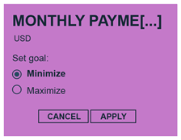
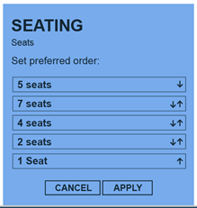
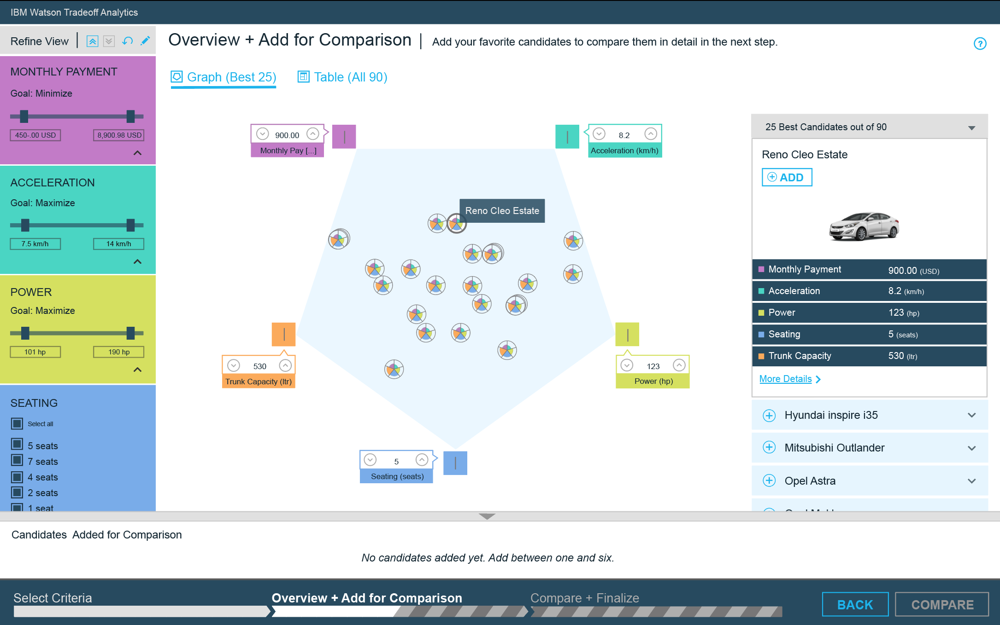
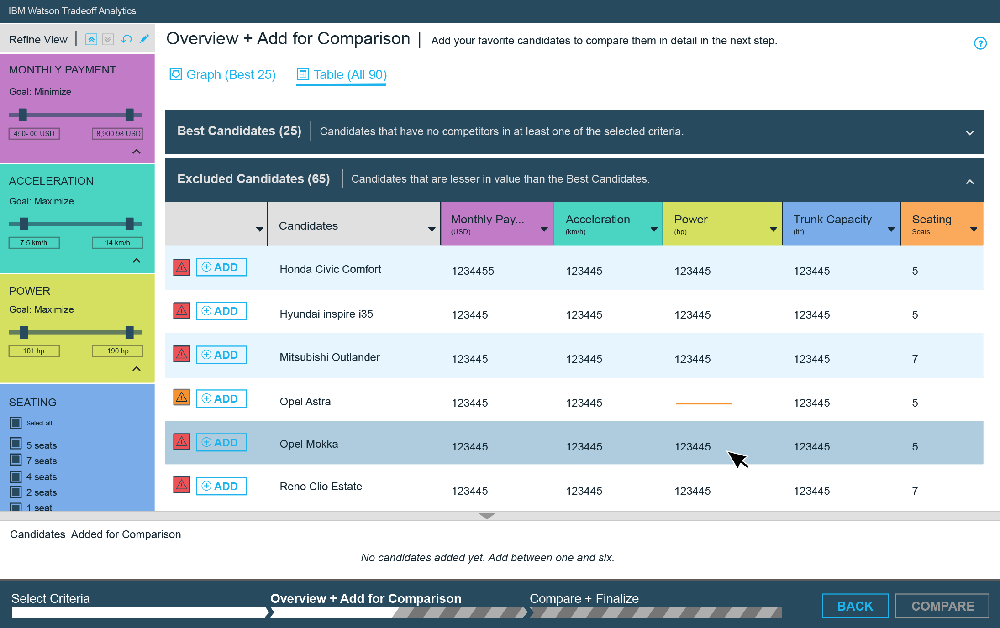
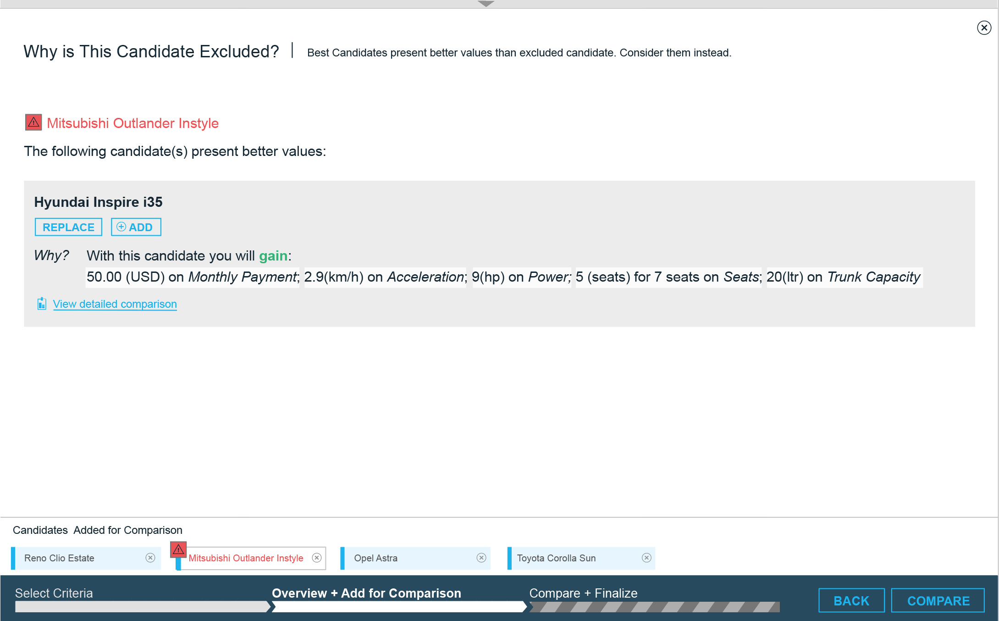
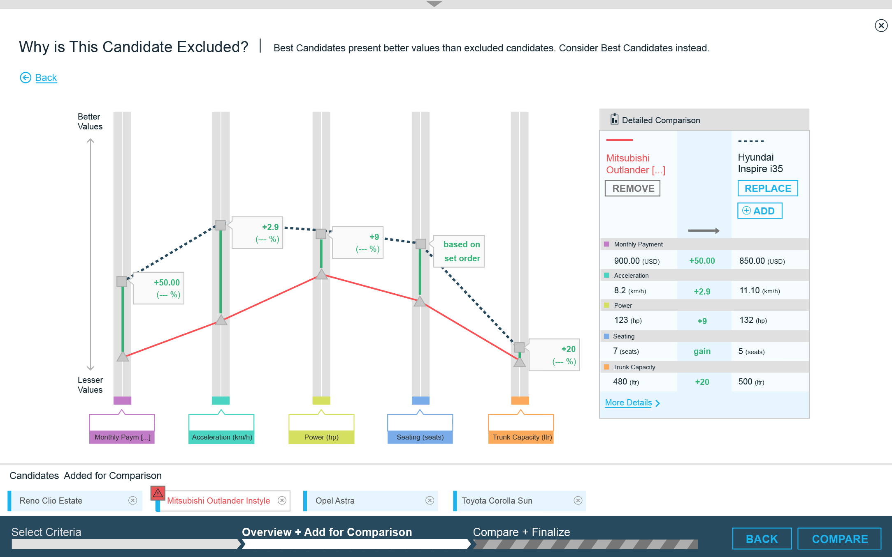
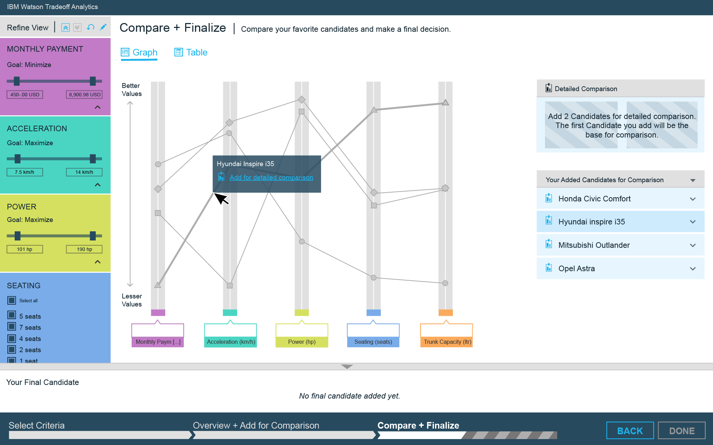
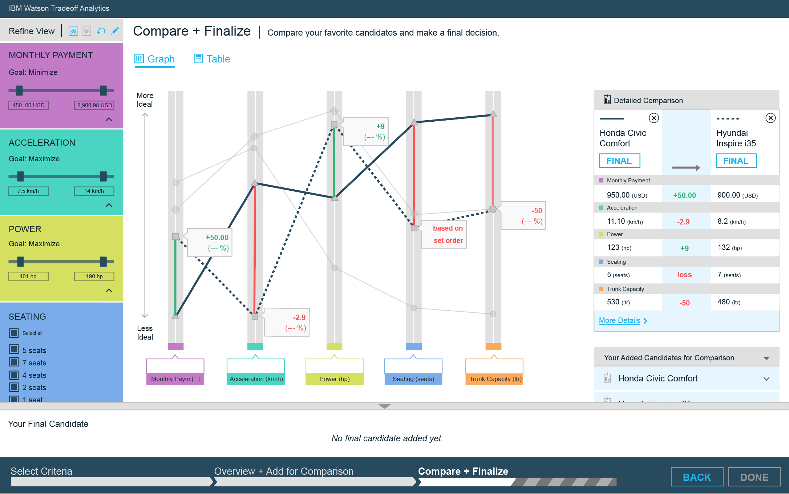

---

copyright:
  years: 2015, 2017
lastupdated: "2017-08-09"

---

{:shortdesc: .shortdesc}
{:new_window: target="_blank"}
{:tip: .tip}
{:pre: .pre}
{:codeblock: .codeblock}
{:screen: .screen}
{:javascript: .ph data-hd-programlang='javascript'}
{:java: .ph data-hd-programlang='java'}
{:python: .ph data-hd-programlang='python'}
{:swift: .ph data-hd-programlang='swift'}

# Using the v2 visualization interface
{: #visualization}

The {{site.data.keyword.tradeoffanalyticsshort}} service makes its interface available as a client library, the {{site.data.keyword.tradeoffanalyticsshort}} widget. The interface provides a guided experience to help users solve their decision problems. It offers a step-by-step approach that breaks down the decision-making process into simple actions that include helpful visualizations.
{: shortdesc}

## Process overview
{: #overview}

When you use the {{site.data.keyword.tradeoffanalyticsshort}} interface, the decision-making experience comprises three main steps:

1.  [Select Criteria.](#step1) As a user, you are part of creating the input to the service API. You select the criteria, or define the objectives, that allow the service to analyze the problem and present an interactive visual display of the best candidate options. The interface follows Ben Shneiderman's famous visual information-seeking mantra: "Overview first, zoom and filter, then details-on-demand" ([Shneiderman, 1996](/docs/services/tradeoff-analytics/references.html#shneiderman1996)).
1.  [Overview + Add for Comparison.](#step2) The service analyzes your options and presents the best candidates on a map visualization. The map provides an overview of where each option lies in terms of its strengths against the various objectives. You can filter objectives on the visualization to focus on different considerations. You can examine option details and add up to six candidates of interest for comparison in the next step. You can also use an alternative table view to examine both the best candidates and those that are excluded.
1.  [Compare + Finalize.](#step3) Selecting a few options in the previous step reduces your pool of candidates to a manageable size. Based on your selections, the interface presents a parallel-coordinates visualization that allows you to perform detailed comparisons between the remaining candidates. You can also access an alternative table view to explore your chosen candidates. After comparing and understanding the tradeoffs among the candidates, you can make a final selection with confidence in your decision.

The steps are iterative and can be revisited and repeated to help you make the best possible choice.

## Step 1. Select Criteria
{: #step1}

The first step in using the interface to resolve a decision problem is to **Select Criteria**. Criteria are the problem's objectives. One of the service's differentiators is its ability to address the challenge of multi-objective decision-making. The service applies its filtering techniques to the list of options and their scores for the objectives.

The interface lists the objectives for the decision problem. To establish the parameters of the decision problem, you define and customize the objectives that you are interested in. This is a crucial part of the process: You decide what matters most and can exercise significant control over minimizing the problem space. (Note that a developer can choose to present the objectives without giving the user control over them.)

### Selecting objectives

As the following image shows, you select the criteria by clicking on an objective tile. The interface assigns the objective a color code to make it easier to identify and work with it in later visualizations. When you add an objective, the interface displays a **Customize** link. Clicking the link for the added objective lets you set and edit its goal.

### Setting goals for numeric and temporal objectives

You can maximize or minimize the goal for a numeric or temporal (date and time) objective. This changes how the service evaluates the options against the objective. For example, when buying a car, the buyer aspires to minimize price and to maximize fuel economy.

### Setting goals for categorical objectives

You can set the order for a categorical objective to indicate your preference for its categories. Use the up and down arrows for the individual categories to specify the preferred order. For example, when setting the preferred order for the number of seats for a car, the number that is placed at the top of the list, say **5 seats**, instructs the service to prefer cars with that number of seats in its filtering.

### Applying objectives

After you select at least three objectives, the **HELP ME DECIDE** button in the footer becomes active. Selecting the button directs the service to analyze the problem. The widget contacts the service to analyze the input and generate the visualization; the application is charged for the call to the service.

Note that all selected objectives are equally important. However, the widget provides filters described in the following steps to let you indicate the objectives you care about the most. The filters let you set thresholds on the objectives' values. For more information, see [Filtering objectives](#filtering).

## Step 2. Overview + Add for Comparison
{: #step2}

The second step in working with the interface is **Overview + Add for Comparison**. In this step, the service presents the best candidate options in an interactive visualization. The purpose of this step is to allow you to refine the decision-making process by focusing only on the best candidates.

### Working with the map visualization
{: #map}

The map visualization's default view is the **Graph** view, which displays the best candidates from the service's analysis in a graphic visualization. This view gives you an overview of the candidates and how they are similar to or different from each other in terms of their strengths with respect to the objectives.

The best candidates are listed on the right side of the graph. Clicking on a best candidates via its glyph on the map or via its entry in the list displays the option's details on the map vertices and as an expanded description beneath the option in the list. If the data set contains images, the service displays the option's image within the list.

The visualization's two-dimensional polygon graphically depicts objectives and candidate options as follows:

-   Each *objective* is a vertex of the polygon that appears in the center of the visualization. The vertices that represent the objectives are color-coded, and a button of the same color is positioned at each vertex. This bird's-eye view exposes the tradeoffs by placing conflicting objectives on different corners of the polygon.

    You can temporarily view a specific objective by clicking on the colored button at its vertex. The first objective you click turns on, or shows, the slices on the glyphs for that objective only. Clicking on additional vertices turns on other objectives and the slices in the glyphs that correspond to them.
-   The *best candidates* are represented by a polar-area glyph within the polygon. The glyphs' colors indicate the extent to which each candidate satisfies the matching objective; the amount of color shown in each slice of the glyph is proportional to the option's value for that objective. In addition, the glyphs are positioned according to their objective values: Candidates whose values are better for an objective tend to be positioned closer to the vertex for that objective. Mousing over a candidate in the list at the right highlights its glyph and vice versa.

    Hovering over a glyph displays a label with the candidate's name and its values for each objective in the box next to each objective's vertex. Clicking on a glyph shows the details of the candidate in the list. It also activates the *walk on the map* feature, which allows you to navigate the map based on one objective. You can move toward candidates with higher or lower values by using the up and down arrow buttons in the box next to the objective's vertex. The starting point for the navigation is the candidate that you clicked on to activate the feature.

    Sometimes, when candidates are very similar to each other, they are clustered. Click on the cluster to expand and show the individual candidates.

The interface also has an accessible alternative **Table** view that shows all candidates, including excluded and incomplete candidates. The graph view shows only the best candidates.

### Understanding candidates
{: #understanding}

When it analyzes a decision problem, the service assigns each option to one of three categories:

-   *Best candidates* are those for which no competing option is strictly better for all objectives. Only best candidates are depicted on the map visualization.
-   *Excluded candidates* are those for which at least one option is clearly superior for all objectives; see [Excluded candidates](#excluded).
-   *Incomplete candidates* are those that fail to specify values for all objectives (at least one value is either missing or invalid); see [Incomplete candidates](#incomplete).

To better understand the relationship between the categories, consider the following simple example. The example has four options, *A* through *D*, and two objectives, *X* and *Y*. Both objectives are to be maximized, meaning that greater values are better. The service analyzes and categorizes each option by considering its values with respect to the two objectives and to the values of the other options.

<table style="width:75%">
  <caption>Table 1. Example options and objectives</caption>
  <tr>
    <th style="text-align:center">Option</th>
    <th style="text-align:center">Category</th>
    <th style="text-align:center">Objective <em>X</em></th>
    <th style="text-align:center">Objective <em>Y</em></th>
  </tr>
  <tr>
    <td style="text-align:center"><strong>A</strong></td>
    <td style="text-align:center">Best</td>
    <td style="text-align:center">5</td>
    <td style="text-align:center">7</td>
  </tr>
  <tr>
    <td style="text-align:center"><strong>B</strong></td>
    <td style="text-align:center">Best</td>
    <td style="text-align:center">7</td>
    <td style="text-align:center">5</td>
  </tr>
  <tr>
    <td style="text-align:center"><strong>C</strong></td>
    <td style="text-align:center">Excluded</td>
    <td style="text-align:center">3</td>
    <td style="text-align:center">4</td>
  </tr>
  <tr>
    <td style="text-align:center"><strong>D</strong></td>
    <td style="text-align:center">Incomplete</td>
    <td style="text-align:center">6</td>
    <td style="text-align:center"></td>
  </tr>
</table>

No option is better than option **A** or **B**, so the service categorizes both as *Best candidates*. Option **C** is clearly inferior to both **A** and **B**, so the service categorizes it as *Excluded*. And option **D** fails to specify a value for objective *Y*, so the service marks it as *Incomplete*.

#### Excluded candidates
{: #excluded}

The interface lists all excluded candidates under the **Excluded** tab in the table view. Excluded candidates do not appear in the graph view, which presents only the best candidates. A red icon appears next to each excluded candidate in the table view. Click the icon to see a detailed explanation of why the option was excluded.

The following images explain why the service excluded the candidate *Mitsubishi Outlander Instyle*. The first image presents a text-based explanation that indicates which candidate is strictly better. The text explains what the user gains by selecting the indicated candidate instead of the excluded one.

The second image is presented when you click the **View detailed comparison** link for the alternative option. It presents a visual explanation that uses a parallel-coordinates view to offer another way of understanding the tradeoffs between the candidates.

#### Incomplete candidates
{: #incomplete}

Incomplete candidates are also considered excluded and do not appear on the map visualization. Incomplete candidates are also found under the **Excluded** tab in the table view. An orange icon distinguishes incomplete candidates from excluded candidates. Unlike excluded candidates, incomplete candidates do not require a lengthy explanation. They are incomplete because of a missing or invalid objective value; an orange line indicates each missing value.

### Filtering objectives
{: #filtering}

Filtering allows you to refine and focus your view on certain candidates by putting thresholds on the objectives that suit your preferences. The filtering process depends on the type of the objective:

-   Numeric and temporal objectives have a slider filter.
-   Categorical objectives have a checkbox filter. The list is set according to the preferred order that was defined in the **Select Criteria** phase.

Adjusting filters does not cause the widget to regenerate the visualization or to contact the service, so the complete set of optimal options does not change. Instead, candidates shown in the visualization become grayed out or active to indicate that they have been removed from or added to consideration based on changes to the filters.

### Adding candidates for comparison

While you explore the candidates in the second step, you can indicate those that best meet your needs by adding them for further consideration in one of the following ways:

-   Via the **+Add** button in the details view of an option in the list
-   Via the **+** icon to the left of the option's name in the list
-   By double-clicking the option's glyph on the map visualization

Candidates that you select are placed at the bottom of the interface under **Added candidates for comparison**. You can add up to six candidates. When you add the first candidate, the **Compare** button in the footer becomes active. Adding candidates for comparison helps you collect those in which you are most interested for closer examination in the following step. This approach lets you minimize the problem space so that you can focus on fewer options and make a decision more easily.

### Tradeoff highlighting

The service helps you minimize regret by highlighting options you might have missed. It is a sensitivity analysis tool that recommends alternatives that might be more appealing than the ones you selected. It highlights areas where you can compromise a little to gain a lot by selecting an alternative that the tool recommends.

For example, once you select a candidate, the widget might advise you that another candidate is also optimal. Small compromises on a few objectives can yield relatively large positive gains for the rest of your objectives.

## Step 3. Compare + Finalize
{: #step3}

The third step in working with the interface is **Compare + Finalize**. In this step, the service presents the candidates you added for comparison. The goal of this step is to enable you to make a final decision from among your chosen candidates by allowing you to access a detailed comparison of pairs of candidates. When you are ready to make a choice, you can select a candidate to add it to the bottom of the interface.

### Working with the parallel-coordinates visualization
{: #pc}

After you add a few options for comparison in the previous step, this third step presents another type of visualization: a line-based view referred to as a *parallel-coordinates visualization*. Parallel-coordinates is a common pattern for geometrically visualizing and analyzing multi-variable data in a multi-dimensional space. The view provides an effective way to conduct a detailed comparison between candidates.

The parallel-coordinates visualization represents objectives and candidates as follows:

-   Each *objective* is represented by a vertical axis. As in the map, each objective is color-coded at its base and has a value box.
-   Each *candidate* appears as a roughly horizontal polyline. Mousing over a candidate in the list at the right of the interface highlights its polyline. Mousing over a polyline displays a label with the candidate's name as well as a link to **Add for detailed comparison**; it also shows the candidate's values for each objective in the base of each objective's axis.

The polyline for each candidate intersects the vertical axis for an objective at a position that reflects its value for that objective. The intersection point indicates the extent to which the option satisfies the objective. For consistency, better values are always positioned vertically higher on an objective's axis.

In other words, candidates are always ranked in a top-down fashion for each objective. The higher the point at which a polyline intersects an axis, the better that candidate satisfies that objective. For example, in the car-buying scenario, the price objective is to be minimized, so less expensive cars intersect the axis near the top and expensive cars near the bottom of the price axis.

### Performing a detailed comparison

To help focus your comparison, a side-by-side detailed comparison of candidates is available. You can add two candidates at a time for detailed comparison. To add candidates for comparison, click on the icon to the left of the name of each candidate in the list or on the **Add for detailed comparison** link for each candidate. The link is available from the **Details** view for a candidate in the list or in the label of a polyline by hovering on a candidate in the visualization.

Detailed comparison helps you understand the tradeoffs between two candidates by presenting

-   A detailed side-by-side comparison on the right of the screen shows what you gain or lose when you go from the first candidate to the second. The interface highlights gain in green and loss in red; equal values are left blank.

    The side-by-side comparison can also display values for other columns that are not objectives (columns that do not participate in the analysis). These values can provide additional information to help you reach a decision.
-   A display on the parallel-coordinates visualization where the polylines for all other candidates are grayed out and only the polylines for the candidates selected for comparison are shown. For each objective, a vertical line and a label indicate whether there is gain or loss between the two candidates. As with the side-by-side comparison, gain is highlighted in green and loss in red.

### Making a final decision

As you compare the candidates and evaluate the tradeoffs, your ultimate goal is to make a final decision. To select a candidate, you click on the **Final** button in the **Details** pane for the candidate or in the side-by-side comparison view if that candidate was added for detailed comparison.

When you make a final selection of a candidate, the candidate appears in the bottom area of the interface above the footer. The process is then complete. By using the interface and its visualizations to explore, refine, and evaluate your options carefully, you have arrived at a satisfactory decision.
